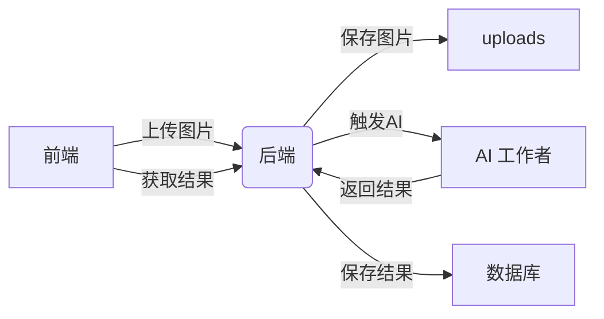

```shell
D:\ai-projects\SeedAi\
├── docker-compose.yml
├── nginx.conf
├── mysql_data\         # MySQL 数据库 (D 盘)
├── uploads\            # 用户上传的图片 (D 盘)
├── datasets\           # 原始数据集 (D 盘)
├── backend\            # 后端代码 (Flask)
│   ├── app.py
│   ├── requirements.txt
│   ├── config.py
│   ├── models.py       # 数据库模型
│   ├── services\       # 业务逻辑层 (可扩展)
│   │   ├── user_service.py
│   │   ├── dataset_service.py
│   │   └── image_service.py
│   └── utils.py        # 工具函数
├── frontend\           # 前端代码 (Vue.js)
│   ├── index.html
│   ├── login.html
│   ├── dataset.html
│   ├── annotate.html
│   ├── style.css
│   └── js\             # 前端逻辑分离
│       ├── main.js
│       ├── login.js
│       ├── dataset.js
│       └── annotate.js
└── pytorch_model\      # AI 模型 (目标检测)
    ├── model.py
    ├── utils.py
    ├── weights\        # 模型权重 (可扩展)
    │   └── yolov5s.pt
    └── inference.py    # 推理模块 (可扩展)
```



# 环境配置

## 1. 安装docker
## 2. 配置vscode
md图形化 插件 Markdown Preview Mermaid Support

管理docker 插件 docker

# 后端架构完善

## 后端技术栈

- **框架**: Flask 2.3.2 + Flask-SQLAlchemy 3.1.1
- **数据库**: MySQL 8.0 + PyMySQL 1.1.0
- **认证**: JWT (PyJWT 2.8.0) + bcrypt 4.0.1
- **ORM**: SQLAlchemy 2.0.23
- **部署**: Docker + Docker Compose
- **其他**: Flask-CORS, cryptography, python-dotenv

## 数据库模型

### User (用户表)
```sql
- id: INTEGER (主键)
- username: VARCHAR(80) (唯一)
- email: VARCHAR(120) (唯一)
- password_hash: VARCHAR(128)
- created_at: DATETIME
- is_active: BOOLEAN
```

### Dataset (数据集表)
```sql
- id: INTEGER (主键)
- name: VARCHAR(100)
- description: TEXT
- created_by: INTEGER (外键 -> users.id)
- created_at: DATETIME
- is_public: BOOLEAN
```

### Image (图片表)
```sql
- id: INTEGER (主键)
- filename: VARCHAR(255)
- original_filename: VARCHAR(255)
- dataset_id: INTEGER (外键 -> datasets.id)
- uploaded_by: INTEGER (外键 -> users.id)
- uploaded_at: DATETIME
- file_path: VARCHAR(500)
- annotations: JSON (标注数据)
```

## API 接口文档

### 认证相关
- `POST /api/auth/register` - 用户注册
- `POST /api/auth/login` - 用户登录
- `GET /api/users/profile` - 获取用户信息

### 数据集管理
- `POST /api/datasets` - 创建数据集
- `GET /api/datasets` - 获取用户数据集
- `GET /api/datasets/{id}` - 获取指定数据集
- `GET /api/datasets/{id}/images` - 获取数据集图片

### 图片管理
- `POST /api/datasets/{id}/upload` - 上传图片到数据集
- `GET /api/images/{id}` - 获取图片信息
- `PUT /api/images/{id}/annotations` - 更新图片标注

### 系统
- `GET /health` - 健康检查

## 后端服务架构

```
Flask App (app.py)
├── config.py          # 配置管理
├── models.py          # 数据库模型
├── utils.py           # 工具函数
├── services/          # 业务逻辑层
│   ├── user_service.py      # 用户服务
│   ├── dataset_service.py   # 数据集服务
│   └── image_service.py     # 图片服务
└── requirements.txt   # 依赖管理
```

## 部署说明

### 1. 环境要求
- Docker & Docker Compose
- VS Code (推荐插件: Docker, Python)

### 2. 启动服务
```bash
# 构建并启动所有服务
docker-compose up -d --build

# 查看服务状态
docker-compose ps

# 查看日志
docker-compose logs backend
```

### 3. 服务端口
- 前端: http://localhost:80
- 后端: http://localhost:5000
- MySQL: localhost:3306

### 4. 停止服务
```bash
docker-compose down
```

## 使用指南

### 1. 用户注册/登录
```bash
# 注册新用户
curl -X POST http://localhost:5000/api/auth/register \
  -H "Content-Type: application/json" \
  -d '{"username":"test","email":"test@example.com","password":"123456"}'

# 用户登录
curl -X POST http://localhost:5000/api/auth/login \
  -H "Content-Type: application/json" \
  -d '{"username_or_email":"test","password":"123456"}'
```

### 2. 数据集操作
```bash
# 创建数据集 (需要认证)
curl -X POST http://localhost:5000/api/datasets \
  -H "Content-Type: application/json" \
  -H "Authorization: Bearer YOUR_JWT_TOKEN" \
  -d '{"name":"My Dataset","description":"Test dataset"}'

# 获取用户数据集
curl -X GET http://localhost:5000/api/datasets \
  -H "Authorization: Bearer YOUR_JWT_TOKEN"
```

### 3. 图片上传
```bash
# 上传图片到数据集
curl -X POST http://localhost:5000/api/datasets/1/upload \
  -H "Authorization: Bearer YOUR_JWT_TOKEN" \
  -F "file=@/path/to/image.jpg"
```

## 安全特性

- **密码加密**: 使用bcrypt进行密码哈希
- **JWT认证**: 无状态令牌认证
- **CORS支持**: 跨域资源共享
- **文件验证**: 上传文件类型和大小限制
- **SQL注入防护**: 使用ORM参数化查询

## 扩展指南

### 添加新API
1. 在 `services/` 中实现业务逻辑
2. 在 `app.py` 中添加路由
3. 更新此README文档

### 添加新模型
1. 在 `models.py` 中定义新模型
2. 在 `services/` 中实现相关服务
3. 运行数据库迁移

### 性能优化
- 数据库连接池配置
- 文件上传异步处理
- API响应缓存
- 数据库索引优化

# 前端架构完善

## 前端技术栈

- **HTML5**: 语义化结构和响应式设计
- **CSS3**: 现代化样式和动画效果
- **Vanilla JavaScript**: 原生ES6+，无框架依赖
- **Fetch API**: 现代HTTP请求处理
- **LocalStorage**: 客户端数据存储
- **部署**: Nginx静态文件服务

## 前端页面结构

### 1. 首页 (index.html)
- 系统欢迎页面
- 快速图片上传功能
- 导航菜单

### 2. 登录页面 (login.html)
- 用户登录表单
- JWT令牌存储
- 登录状态管理

### 3. 数据集管理 (dataset.html)
- 数据集上传功能
- 数据集列表展示
- 文件管理界面

### 4. 图像标注 (annotate.html)
- 图片标注工具
- 标签添加/删除
- 标注数据保存

## 前端功能特性

### 🎨 用户界面
- **响应式设计**: 支持桌面和移动设备
- **现代化UI**: 简洁美观的用户界面
- **导航系统**: 统一的页面导航
- **状态反馈**: 实时的操作反馈

### 🔐 认证管理
- **JWT令牌**: 本地存储和管理
- **自动登录**: 页面刷新保持登录状态
- **权限控制**: 基于令牌的API访问

### 📁 文件管理
- **拖拽上传**: 支持文件拖拽上传
- **格式验证**: 图片文件类型检查
- **进度显示**: 上传进度反馈
- **批量处理**: 支持多文件操作

### 🏷️ 标注工具
- **可视化标注**: 图片标注界面
- **标签管理**: 添加/删除标注标签
- **数据持久化**: 标注数据自动保存
- **导航控制**: 上一张/下一张图片切换

## 前端架构设计

```
frontend/
├── index.html          # 首页
├── login.html          # 登录页
├── dataset.html        # 数据集管理
├── annotate.html       # 标注页面
├── style.css           # 全局样式
└── js/                 # JavaScript模块
    ├── main.js         # 首页逻辑
    ├── login.js        # 登录逻辑
    ├── dataset.js      # 数据集管理
    └── annotate.js     # 标注逻辑
```

## API集成说明

### 认证接口
```javascript
// 用户登录
const response = await fetch('/api/auth/login', {
    method: 'POST',
    headers: { 'Content-Type': 'application/json' },
    body: JSON.stringify({ username, password })
});

// 使用JWT令牌
const response = await fetch('/api/datasets', {
    headers: { 'Authorization': `Bearer ${token}` }
});
```

### 文件上传
```javascript
// FormData上传
const formData = new FormData();
formData.append('file', file);
formData.append('name', datasetName);

const response = await fetch('/api/datasets', {
    method: 'POST',
    headers: { 'Authorization': `Bearer ${token}` },
    body: formData
});
```

## 部署配置

### Nginx配置
```nginx
server {
    listen 80;
    server_name localhost;
    root /usr/share/nginx/html;
    index index.html;

    # API代理到后端
    location /api/ {
        proxy_pass http://backend:5000/;
        proxy_set_header Host $host;
        proxy_set_header X-Real-IP $remote_addr;
        proxy_set_header X-Forwarded-For $proxy_add_x_forwarded_for;
        proxy_set_header X-Forwarded-Proto $scheme;
    }

    # 静态文件服务
    location /static/ {
        alias /usr/share/nginx/html/static/;
    }
}
```

## 前端开发指南

### 页面开发规范
1. **HTML结构**: 使用语义化标签
2. **CSS样式**: 遵循BEM命名规范
3. **JavaScript**: 使用ES6+语法，模块化开发
4. **错误处理**: 完善的错误提示和处理

### 组件开发
```javascript
// 统一的API调用模式
async function apiRequest(url, options = {}) {
    const token = localStorage.getItem('token');
    const defaultOptions = {
        headers: {
            'Authorization': token ? `Bearer ${token}` : '',
            'Content-Type': 'application/json'
        }
    };

    try {
        const response = await fetch(url, { ...defaultOptions, ...options });
        const data = await response.json();

        if (!response.ok) {
            throw new Error(data.message || '请求失败');
        }

        return data;
    } catch (error) {
        console.error('API请求错误:', error);
        throw error;
    }
}
```

### 状态管理
```javascript
// 用户状态管理
class AuthManager {
    static getToken() {
        return localStorage.getItem('token');
    }

    static setToken(token) {
        localStorage.setItem('token', token);
    }

    static isLoggedIn() {
        return !!this.getToken();
    }

    static logout() {
        localStorage.removeItem('token');
        window.location.href = 'login.html';
    }
}
```

## 浏览器兼容性

- **Chrome**: 90+
- **Firefox**: 88+
- **Safari**: 14+
- **Edge**: 90+

## 性能优化

### 前端优化
- **代码分割**: 按页面加载JavaScript
- **资源压缩**: CSS和JS文件压缩
- **图片优化**: 懒加载和格式优化
- **缓存策略**: 合理使用浏览器缓存

### 用户体验
- **加载提示**: 异步操作的加载状态
- **错误处理**: 友好的错误提示
- **响应式**: 适配不同屏幕尺寸
- **无障碍**: 支持键盘导航和屏幕阅读器

## 扩展指南

### 添加新页面
1. 创建HTML文件
2. 添加对应的JavaScript文件
3. 在导航菜单中添加链接
4. 更新路由和权限控制

### 添加新功能
1. 在相应页面添加UI元素
2. 实现JavaScript交互逻辑
3. 调用后端API接口
4. 更新样式和用户反馈

### 样式定制
1. 修改`style.css`全局样式
2. 添加页面特定样式
3. 使用CSS变量实现主题定制
4. 确保响应式设计